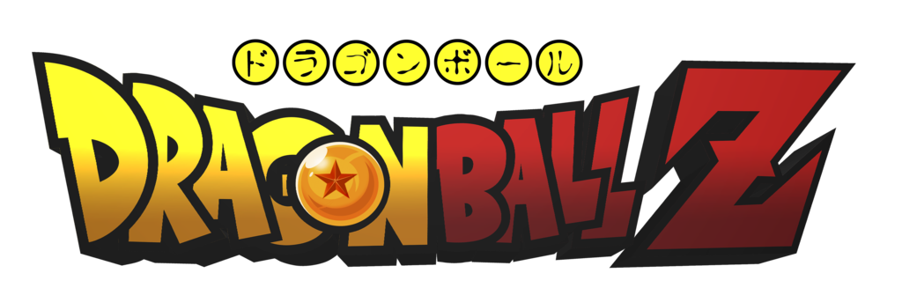

<div align="center">

# 🐉 Dragon Ball Z Memory Game ⭐



### *Can you remember every Z Fighter without picking the same one twice?* 💥

[**🎮 Play the Game**](https://rsterenchak.github.io/matchingGame-test/) · [**🐙 GitHub**](https://github.com/rsterenchak)

</div>


---

## ⚡ What is this?

A memory-matching card game with a Dragon Ball Z theme, built with React and Vite. Click cards without repeating any to climb your high score — each unique character picked earns a point, while picking the same card twice ends the run faster than Yamcha in a fight. 💀

## 🥋 How to Play

1. Hit the **Fight** button on the home page to enter the arena ⚔️
2. Each turn, 8 randomly selected character cards are dealt face-up
3. Click a card you haven't picked yet to score a point ✨
4. Cards flip and reshuffle after every pick — keep mental track of who you've already chosen 🧠
5. Click a repeat → **Game Over** 💀
6. Pick all 16 unique characters → **You Win!** 🏆
7. Your high score persists across attempts — beat it if you can!

## ✨ Features

- 🏠 **Two-page navigation** between an animated home screen (Kame House vibes) and the game board
- 🎵 **Looping background music** — Dragon Ball Z opening theme on home, Namek theme during gameplay
- 🔄 **Card flip animation** — cards go face-down between turns before revealing the new hand
- 🌐 **Live character data** pulled from the [Dragon Ball API](https://dragonball-api.com/) — official art, official heroes, official villains
- 📊 **Score tracking** for both current run and session high score
- 💥 **Win/lose pop-up** with a retry button so you can jump straight back in
- 📱 **Fully responsive** — phones, tablets, desktops, all the way down to 320px wide

## 🛠️ Tech Stack

| Tool | Why it's here |
|------|---------------|
| ⚛️ **React 18** | Component-based UI with hooks for all game state |
| ⚡ **Vite** | Lightning-fast dev server with HMR |
| 🎨 **CSS** | Custom styling, media queries, keyframe animations, Shojumaru font |
| 🐉 **Dragon Ball API** | Character data and image URLs |
| ▲ **Vercel** | Deployment |

## 🚀 Getting Started

```bash
# Clone the repo
git clone https://github.com/rsterenchak/matchingGame-test.git
cd matchingGame-test

# Install dependencies
npm install

# Start the dev server (powering up...)
npm run dev

# Build for production (going Super Saiyan)
npm run build

# Preview the production build
npm run preview
```

Open `http://localhost:5173` (or whichever port Vite reports) to start training. 💪

## 📁 Project Structure

```
src/
├── index.jsx           # React entry point
├── MainSection.jsx     # Top-level component; handles routing and audio
├── HomePage.jsx        # Landing screen with logo, Fight button, music toggle
├── PlayPage.jsx        # Game board, shuffle logic, scoring, win/lose
├── Card.jsx            # Individual card; click logic and game-over checks
├── CardBack.jsx        # Face-down card shown during the shuffle animation
├── style.css           # All styling, including responsive breakpoints
└── assets/             # Images, audio, SVGs, and the Shojumaru font
```

## 🧠 How the Game Logic Works

The shuffle and scoring flow lives mostly in `PlayPage.jsx` and `Card.jsx`. Every turn:

1. 🎲 `shuffleArray()` generates 8 non-duplicate random indices from the 16-character pool, with a check that at least one index points to an unpicked card
2. 🃏 The 8 selected cards split into top and bottom rows and render as `<Card>` components
3. 🖱️ Clicking a card runs `handleCardClick()`, which checks whether the card is in the `pickedArray`:
   - ❌ **If yes** → game over, show the retry pop-up
   - ✅ **If no** → push it to `pickedArray`, increment the score, call `shuffleNow()` to re-deal
4. ✨ The card-flip effect uses a `useEffect` watching `activeShuffledArray`, toggling `isSide` after a 1-second interval to swap `<CardBack>` placeholders for the real cards

## 🙌 Credits

- 🐉 Character data and art: [Dragon Ball API](https://dragonball-api.com/)
- 🎨 Background art, music, and character likenesses: © Toei Animation / Akira Toriyama / Shueisha — used here for non-commercial portfolio purposes
- 🔤 Font: [Shojumaru](https://fonts.google.com/specimen/Shojumaru) by Astigmatic

## 👤 Author

Built with 💛 by [@rsterenchak](https://github.com/rsterenchak)

<div align="center">

*"It's over 9000!"* — probably not your score, but keep training. 🔥

</div>
